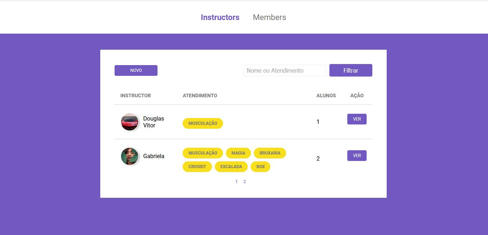
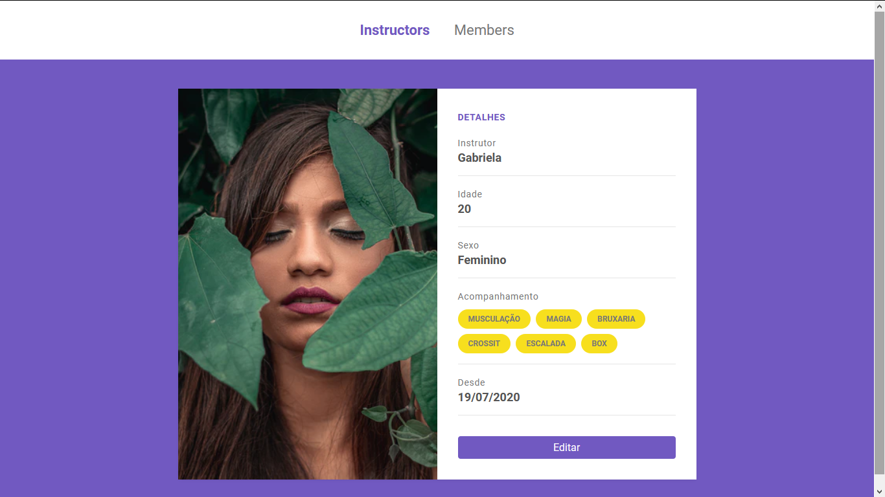
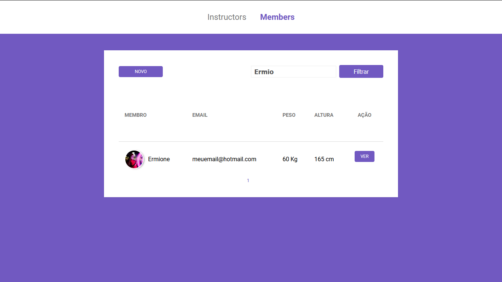

# Tests and Studies
##### Repositório para postagem de testes de códigos e estudos de funcionaldiades de diversos conteúdos aprendidos.

## **Projetos**

1.[Exemplo 01 : Relógio animado](https://github.com/douglas-vitor/tests_and_studies/tree/master/exemplo01-relogio_animado)
- Simples página html/css, com relógio dinâmico sendo pego por javascript com a função Date.
- Conjunto de condições if, para alterar dinâmicamente background color da página e imagem icon.
- Função Carregar, resposavel pela mensagem de saudação, cor de fundo, icone visivel e relógio é atualizado a cada 1 segundo pelo metodo setInterval().
###### Prints

2.[Simples portfolio](https://github.com/douglas-vitor/tests_and_studies/tree/master/exemplo02-simples_portfolio)
- Simples exemplo de portfolio, usando as tecnologias JavaScript, Css e Html.
- Estrutura de arquivos usando template engine Nunjucks.
- Exportação de dados dinâmicos através de JS.
###### Prints

3.[Controle de academia](https://github.com/douglas-vitor/tests_and_studies/tree/master/exemplo03-controle_de_academia)
- Sistema completo de gestão de intrutores e membros de uma academia.
- Criado a estrutura de paginas, utilizando html, css, javascript e a template engine Nunjucks;
- Criado pagina de detalhes dos instrutores e membros;
- Criado pagina de edição dos instrutores e membros;
- Adicionado função para listagem de todos os instrutores e membros no index, adicionado função de confirmação de exclusão de instrutor/membro;
- Adicionado persistencia de dados utilizando banco de dados postgres;
- Adicionado campo de filtro de pesquisa para instrutores e membros;
- Adicionado paginação na listagem de instrutores e membros.
###### Prints

 

4.[Simples site de empresa](https://github.com/douglas-vitor/tests_and_studies/tree/master/exemplo04-simples_site_empresa)
- Simples modelo de site para empresas que estão iniciando no mercado;
- Utilizado a ideia de mobile first;
###### Prints
Em breve!