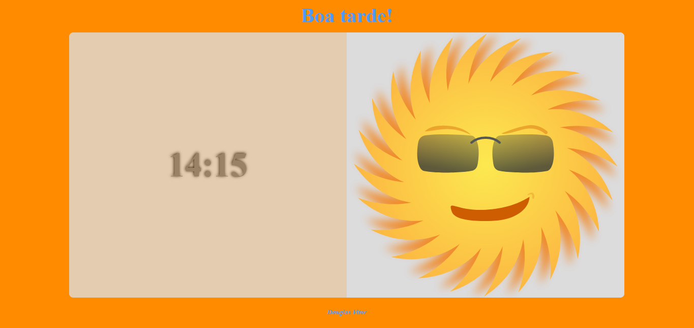

# Tests and Studies
##### Repositório para postagem de testes de códigos e estudos de funcionaldiades de diversos conteúdos aprendidos.

## **Projetos**

1.[Exemplo 01 : Relógio animado](https://github.com/douglas-vitor/tests_and_studies/tree/master/exemplo01-relogio_animado)
- Simples página html/css, com relógio dinâmico sendo pego por javascript com a função Date.
- Conjunto de condições if, para alterar dinâmicamente background color da página e imagem icon.
- Função Carregar, resposavel pela mensagem de saudação, cor de fundo, icone visivel e relógio é atualizado a cada 1 segundo pelo metodo setInterval().
###### Prints

